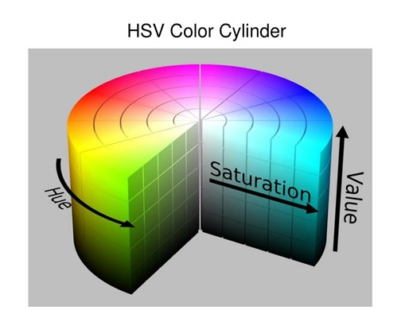
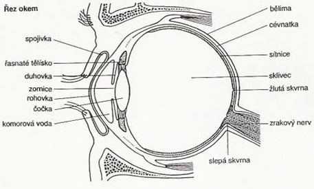
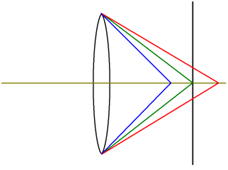
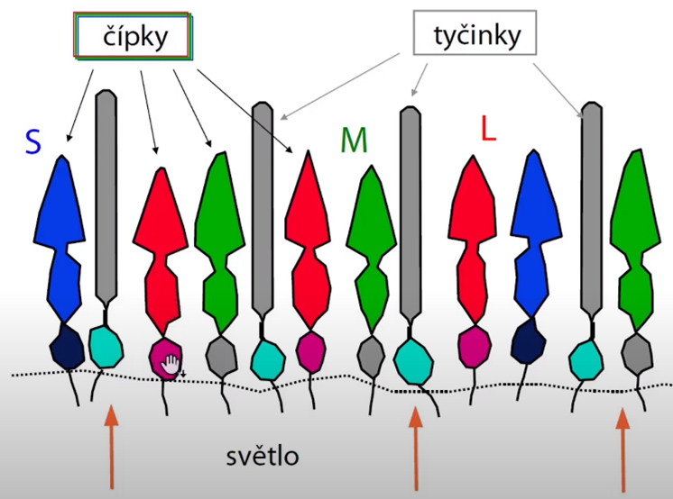
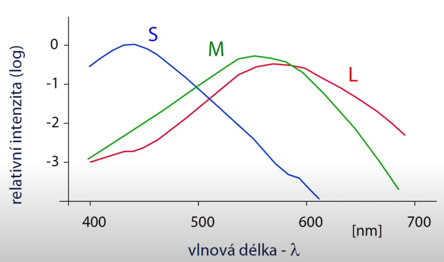
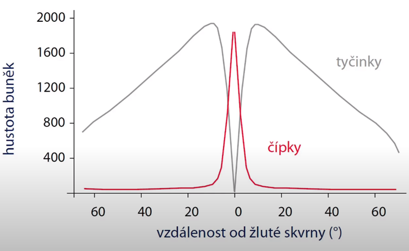
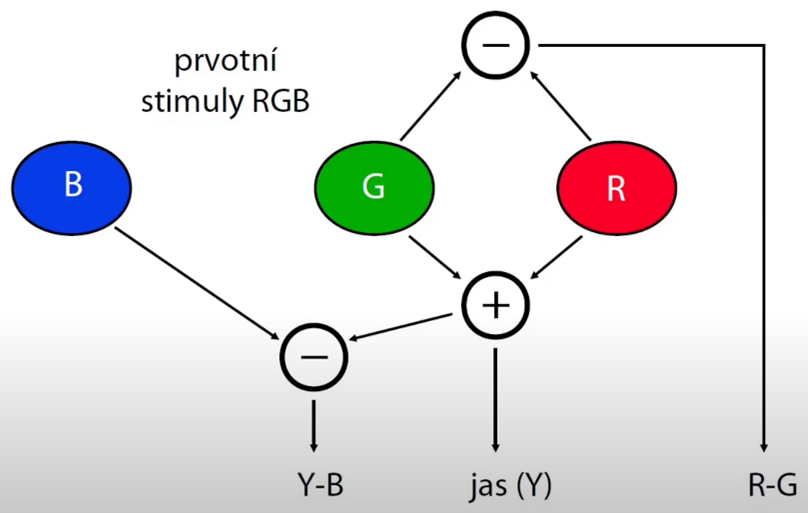
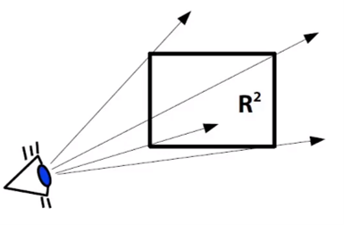
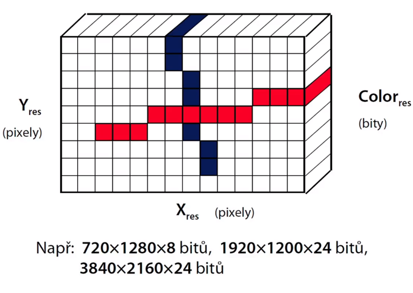

# Barevné vidění

Světlo má duální charakter – můžeme ho chápat jako částice a jako vlnění. Pokud chceme zkoumat barvy, tak nás zajímá světlo jako vlnění.

Spektrogram; viditelné světlo, spektrum – vlnová délka 400 – 700 nm

Ve fyzikální realitě existuje nekonečno dimenzionální velký prostor všech spekter. Prostor lidského vnímání barev je trojrozměrný. Ptáci mají 4 rozměry (4 druhy fotopigmentů).

S nedokonalým lidským vnímáním barev souvisí pojem metamerismus = jev, kdy se dvě barvy lidskému zraku jeví jako stejné, přestože z hlediska spektrální charakteristiky stejné nejsou. Takovým barvám se říká metamery.

## Grassmanovy zákony (1854)

<figure>
  
</figure>

Lidské oko vnímá: 
- Dominantní vlnovou délku (odstín, „hue“) – základní barva, to, čím se liší červená a modrá.
- Čistotu barvy (sytost, „saturation“) – poměr, v jakém je dokonalá čistá barva smíchána s bílou barvou; sytost se udává v procentech (0% nebarevná, monochromatická, odstín šedé; 100% dokonale sytá barva př. nejčervenější červená).
- Intenzitu (jas, „brightness“) – kolik fotonů do našeho oka proudí nebo zachytí objektiv fotoaparátu.

Barvy lze aditivně skládat (A = B, C = D -> A + C = B + D).

<figure>
  
</figure>

## Lidské oko

<figure>
  
</figure>

- Čočka – smršťuje a natahuje (pomocí svalů), mění ohniskovou mohutnost.
- Sítnice – vnitřní tenká vrstva, hl. funkce – snímání a předzpracování světelných signálů přicházejících na sítnici skrze čočku.
- Sklivec – vyplňuje 2/3 vnitřního prostoru oční koule za oční čočkou a jejím závěsným aparátem, sklivec má barvu do žluta -> modrá barva znevýhodněna.
- Slepá skvrna – místo na sítnici, kde zrakový nerv ústí do oční bulvy a ještě není rozvětven na jemná nervová vlákna opatřená elementy citlivými ke světlu. To znamená, že tam nejsou světločivé buňky.
- Žlutá skvrna – místo na oční sítnici, kde je největší hustota čípků, a tedy i nejostřejší vidění.
- Čípky – fotoreceptorická buňka v oční sítnici, která umožňuje barevné vidění.
- Tyčinky – fotoreceptorická buňka v sítnici, umožňuje vnímání kontrastů, uplatňují se při nízkém osvětlení.

Většina nedokonalostí je naší nervovou soustavou potlačena.

## Chromatická aberace (barevná vada)

<figure>
  
</figure>

Barevná vada způsobená závislostí ohniskové vzdálenosti čoček na vlnové délce světla. Fyzikální podstatou tohoto jevu je závislost indexu lomu u všech průhledných látek na vlnové délce. Čočky lámou světlo každé barvy jinak (záření dlouhovlnné, tedy červené, nejméně, krátkovlnné, tedy fialové, nejvíce) -> Oko jinak zaostřuje na červenou, jinak na modrou.

Ve fotografii se to řeší tak, že objektiv je složen z několika čoček (buď na sobě nalepeny nebo se vzduchovou mezerou) -> potlačení kulové vady a barevné.

## Sítnice

<figure>
  
</figure>

- Čípky – dělí se podle vnímání na: S (small, nejvíc citlivé na krátké vlnové délky), M (middle, střední barvy), L (large, dlouhá vlnová délka).
- Tyčinky – Pokud se podíváme na graf (na ose x vlnová délka, y relativní intenzita (log)) vnímání S, M a L čípků všimneme si, že průběh M a L je hodně podobný. To souvisí s poruchy vnímání barev červené a zelené – daltonismus.

<figure>
  
</figure>

## Rozložení fotoreceptorů 

- Žlutá skvrna – nejvíce čípků, zde nejsou přítomny tyčinky, tyčinky nejvíce kolem žluté skvrny.

<figure>
  
</figure>

## Předzpracování barev

Zjednodušeně řečeno, zelená informace a červená se skládají dohromady a tvoří kanál, kterému se říká jas (Y – ang. zkratka). Abychom byli schopni rozeznat červenou a zelenou, musí se nějakým způsobem odečíst (zaznamenat jejich poměr) do rozdílového signálu u nás označeného jako R-G. Modrá složka není rovnou přenášená dál, ta se odečte od jasu, což vytvoří třetí kanál Y-B. Tyto kanály pak jdou do našeho centra vidění v mozku.

Tyto procesy se odehrávají v reálném čase na naši sítnici.
<figure>
  
</figure>

## Vlastnosti systému vidění 

Různá citlivost na červenou (relativní citlivost 0,3), zelenou (0,6) a modrou (0,1) barvu. Navíc střed žluté skvrny neobsahuje „modré“ čípky.
Zaostřuje se podle jasové složky (Y = R + G). Nelze dobře zaostřit na rozdíly v modré složce.

- Integrační schopnost sítnice:
  - Vnímáme samostatné tečky a zároveň jejich hustotu.
  - Umožňuje použít rozptylovací metody (dithering).

- Větší rozlišovací schopnost ve svislém a vodorovném směru. V šikmých směrech asi o 30% menší.

- Přeostřování na barvy vzdálené ve spektru (červená a modrá).

- Setrvačnost („afterimage“) – chemické vyčerpání některých receptorů; př. máme červené kolečko na bílém pozadí, koukáme se dlouho pouze na červené kolečko, pak se podíváme na bílé pozadí a jakoby vidíme kolečko v doplňkové barvě -> červené čípky jsou vyčerpány, musí si odpočinout a chvilku trvá než zase dosáhnou původní citlivosti.

- Očekávání („expectation“) – psycho-fyziologická vlastnost; náš zrakový systém nám podsouvá informaci, kterou ve skutečnosti nevidíme; př. pokus s obrázky, ukázalo se červené jablko a další obrázky, mezitím se ten samý obrázek s červeným jablkem opakoval, až se potlačila červená složka… lidé nahlašovali červené jablko, i když červená nebyla.

- Vliv okolí („surround“ effect):
  - Vjem barvy závisí na okolních barvách/intenzitách.
  - Hnědá barva „neexistuje“ (hodně tmavá červená nebo oranžová, v duze není, neexistuje hnědá vlnová délka).

- Čočka a sklivec se zbarvují stále více do žluta. Ve stáří klesá schopnost vidět krátké vlnové délky.

## Vady barevného vidění

- Splynutí „červeného“ a „zeleného“ pigmentu (nebo absence jednoho z nich) – nejčastější vada.
- Chybí „modrý“ pigment.
- Chybějí čípky vůbec („monochromats“).

## Doporučení pro grafický design

- Používat barvy střízlivě – maximálně 4 až 6 různých barev, odstínů může být více.
- Nekreslit modrou barvou malé objekty a tenké čáry – málo „modrého“ pigmentu ve středu žluté skvrny.
- Na pozadí nepoužívat červenou a zelenou – modrá i žlutá vyhovují.
- Nekreslit vedle sebe syté barvy daleko ve spektru – aby oko nemuselo pořád přeostřovat, únava očí.
- Používat barvy logicky a konsistentně.

# Rastrová a vektorová grafika

## Obrazová funkce

Zobrazení z nějaké části reálné roviny do prostoru atributů (barev). Znamená to, že každému bodu v nějakém obdélníku (nejčastěji) roviny je přiřazena barva. Důležité je slovo každému, neboť my obrazovou funkci chápeme jako spojitý objekt, kde je nespočetně mnoho bodů, kterým jsou přiřazeny barvy. V digitální počítačové grafice nepraktický pojem – v přírodě nekonečně zvětšovatelný obraz.

<figure>
  
</figure>

Můžeme si to představit tak, že se koukáme z okna, co tam vidíme, je obrazová funkce. Když se na to koukáme obyčejným okem, vidíme limitované množství detailů, pokud si vezmeme dalekohled, uvidíme toho víc, když si vezmeme profesionální dalekohled, uvidíme toho ještě víc atd. -> bez omezení můžeme zvětšovat.

Souřadnice vodorovná a svislá jsou v obrázku reprezentovány reálnými čísly. V počítači nepracujeme s takovými nekonečnými objekty, ale máme obraz digitalizovaný.

Při digitalizaci obrazu dochází k dvojí diskretizaci obrazu (nahrazení spojité veličiny diskrétní veličinou):
1. Diskretizace – prostorové souřadnice nejsou spojité a jsou nahrazeny nějakými souřadnicemi, které mají konečný počet hodnot. Provádí se vzorkování roviny v pravidelné mřížce. Dostáváme matici pixelů (pixel = 1 buňka rastrového obrazu). Praxe: snímací sensor fotoaparátu, kamery -> v pravidelné mřížce rozmístěny jednotlivé buňky, které jsou citlivé na světlo; jako výstup dostáváme rastrový obraz
2. Diskretizace – týká se hodnot pixelů, ty jsou ukládány jako celá čísla v nějakém rozsahu (např. 0–255 na jeden kanál) nebo jako čísla v pohyblivé řádové čárce (nejčastěji floaty) v HDR grafice

## Rastrový vs vektorový přístup

### Rastrový výstup

- Obraz rozložen na pixely, každý pixel obsahuje svoji hodnotu (tedy barvu), data mají omezené rozlišení (např. fotoaparát má 20 Mpx -> 20 mil. pixelů) -> při velkém zvětšení ztráta kvality
- Jsou přímo ovládány (adresovány) jednotlivé pixely
- Data jsou závislá na rozlišení (nelze jednoduše škálovat)

### Vektorový výstup

- Všechny objekty jsou popsány matematicky, pak se zadá výplň; můžeme libovolně zvětšovat, otáčet...
- Zobrazují se přímo složitější objekty (čáry, křivky, písmo, plošné útvary)
- Data nejsou závislá na rozlišení (lze je škálovat až v zobrazovacím zařízení)

## Grafický výstup

### Podle technologie výstupu

- Vektorový výstup – dnes už téměř nepoužívá (steré displeje, stolní plotter starší osvitové jednotky?)
- Rastrový výstup (displeje, tiskárny, plottery)

### Podle komunikace

- Vektorové zařízení (GPU, SVG standard /W3C/, Adobe PDF, PostScript) – na vstupu dostanou vektorovou grafiku, kterou převedou na rastr
- Rastrové zařízení (běžné video-adaptéry, tiskárny v grafickém režimu)

## Rastrový obraz

- Obraz má nějaké rozlišení. Pixely jsou rozmístěny v pravidelné mřížce. Pixel má stejnou výšku a šířku. V pixelu uložena barva. Kromě barvy, nejčastěji třísložkové RGB, se může použit odstín šedé - 1 kanál -> 1 a 3 kanály nejčastější systém, dále možná průhlednost – další kanál – RGBA (RGB rozšířen o alfa kanál). Velikosti informace uložené v pixelu se říká hloubka a udává se v bitech.

Příklad: 3840x2160x24 bitů

<figure>
  
</figure>

### Formát pixelu

- Celočíselné hodnoty - 
  - Starší, klasický přístup
  - Obyčejně [8 bit (s paletou)], 3x8 bit nebo 4x8 bit
- Plovoucí desetinná čárka – v případě, že nám nestačí jen celočíselné údaje k ukládání informací a používají se údaje s plovoucí desetinnou čárkou, tak se mluví o HDR grafice. Tak se dají reprezentovat obrázky v téměř nezkreslené dynamice. V pixelu někdy můžeme najít ne 3 byty, ale 3 floaty, což dává dohromady 96 bitů. Někdy se dává poloviční float –> 3x half (48 bitů) 
  - HDR grafika („High Dynamic Range“)
  -	Obyčejně 3xfloat (96bit) nebo 3x half (48bit)
  -	Bez problému se ztrátou přesnosti

  ## Vekrorové kreslení
Sada vektorových příkazů pro kreslení jednotlivých grafických primitiv
-	Čára („moveto“, „lineto“), křivka („curveto“)
-	Základní tvary („rect“, „circle“, „polygon“…)

Definice barev a vzorků pro vyplnění
-	Základní přístupy: „fill“, „stroke“

Vykreslení textu
-	Všechny bázně typografické atributy (font, velikost, mezery, „kernings“…)

### Vektorový formát SVG
W3C standard – všechny běžné současné WWW prohlížeče (HTML5), podpora pro animace, uživatelsky souřadný systém, 2D transformace, ořezávání…
Založen na XML syntaxi 

## Barevný systém RGB
Základní barevné složky: červená (L čípky), zelená (M čípky), modrá (S čípky). RGB systém znamená 3 čísla popisující barvu, 3 čísla v každém pixelu
-	Vychází z aktivního zobrazování (staré CRT monitory)
-	Lidský zrakový systém vnímá podobně

Aditivní skládání barev
-	Černé pozadí (nulová barva, vypnutý displej)
-	Např. bílou odstaneme složením maxim všech tří složek

